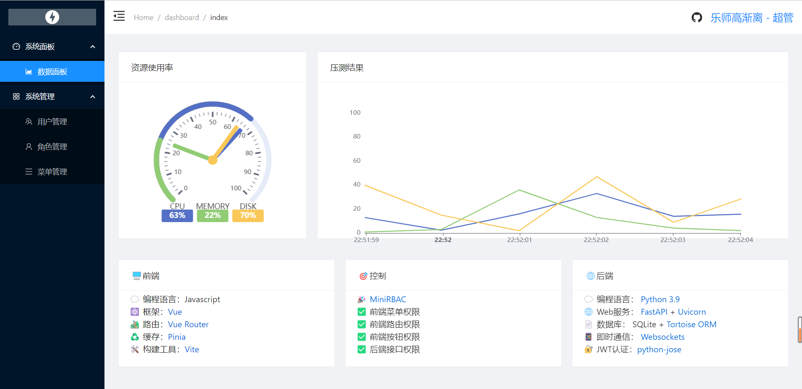
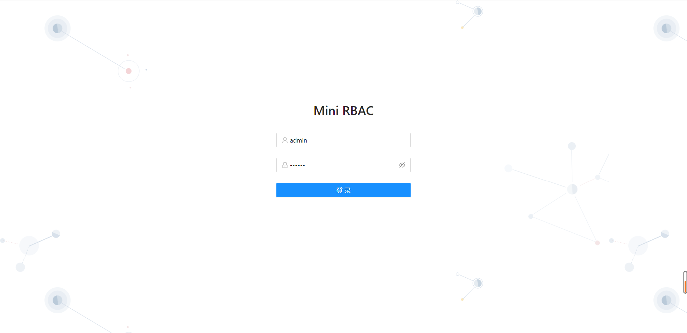
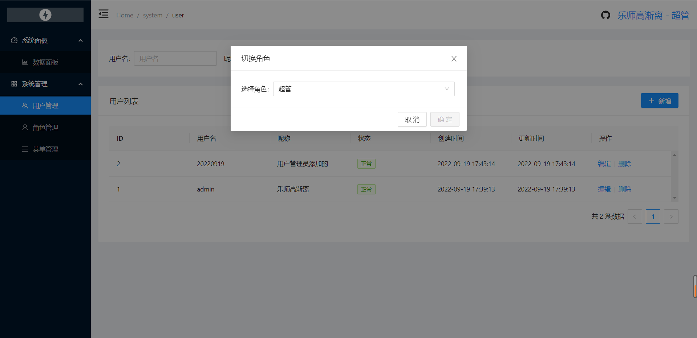
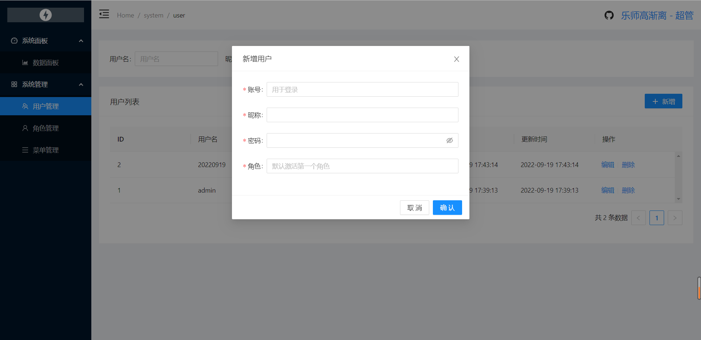
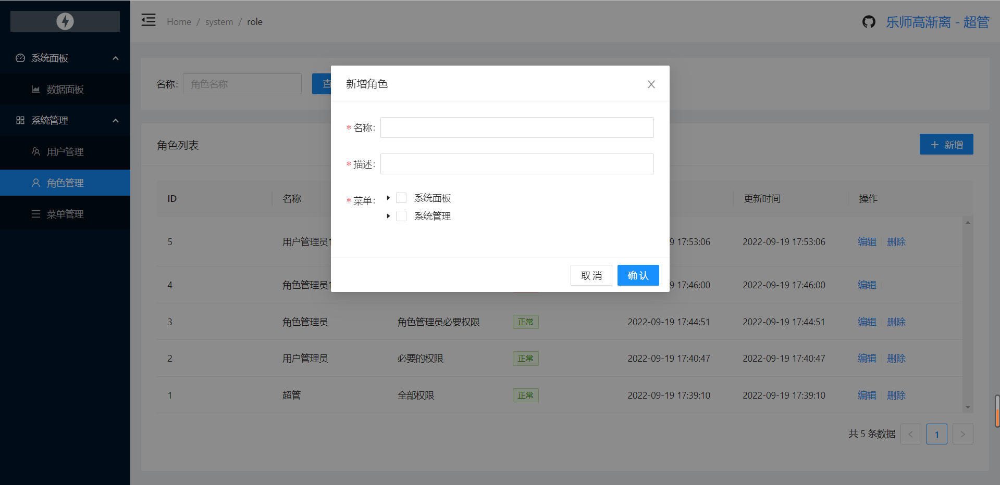
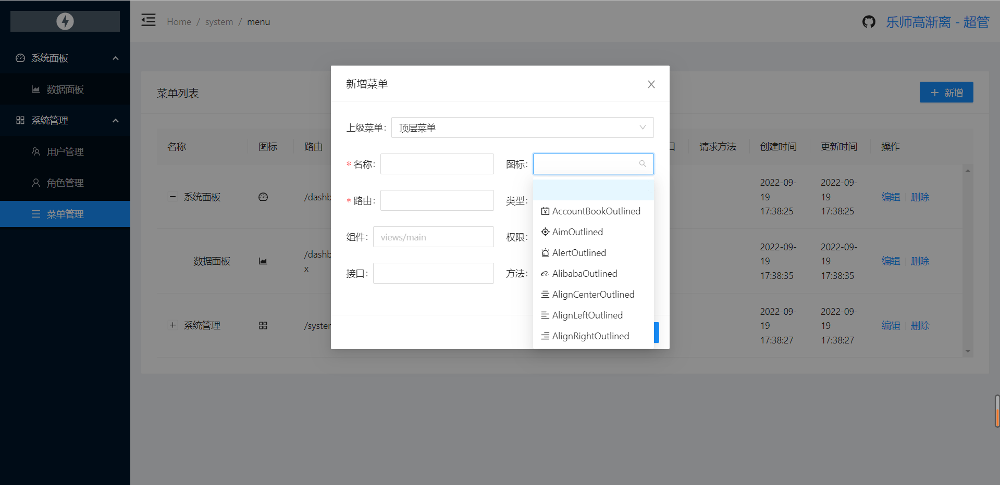
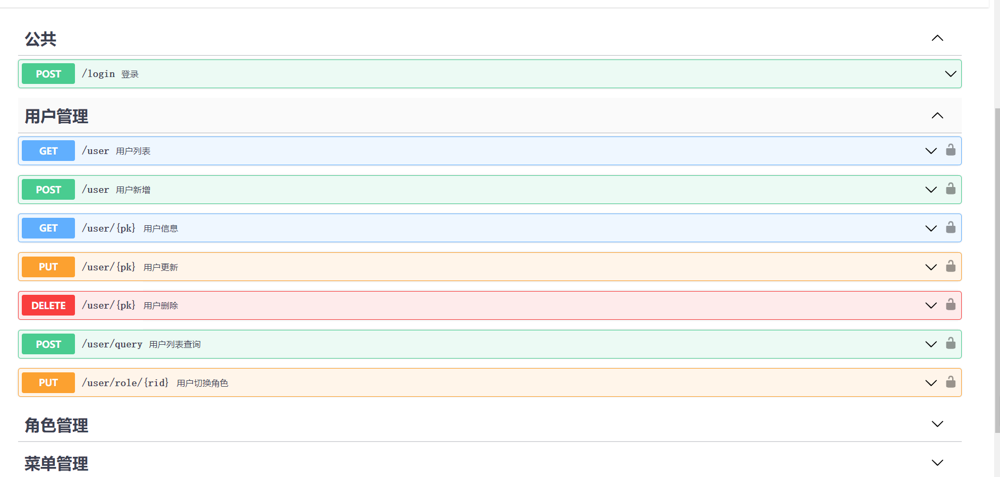
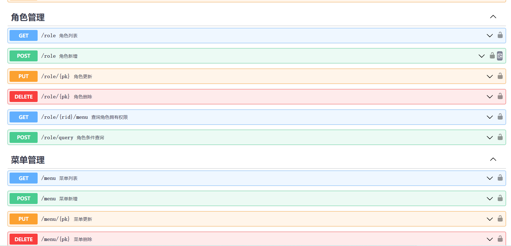

# Mini RBAC
`Python(FastAPI)`、`VUE3`实现，仅保留核心权限控制的极简后台管理。


[演示地址-前端: http://49.232.203.244:1856](http://49.232.203.244:1856/login)

[演示地址-接口地址: http://49.232.203.244:1855/docs](http://49.232.203.244:1855/docs)

## 功能
### 权限控制
- [x] 前端菜单权限控制
- [x] 前端路由权限控制
- [x] 前端按钮权限控制
- [x] 后端接口权限控制
### 业务功能
- [x] 登录、退出、切换角色
- [x] 用户管理 -> 新增、编辑、删除、查询
- [x] 角色管理 -> 新增、编辑、删除、查询
- [x] 菜单管理 -> 新增、编辑、删除、查询


# 使用框架&工具
## 前端 `node 16.15 LTS`
```json
{
    "@kangc/v-md-editor": "^2.3.15",
    "ant-design-vue": "^3.2.12",
    "axios": "^0.27.2",
    "echarts": "^5.3.3",
    "moment": "^2.29.4",
    "normalize.css": "^8.0.1",
    "pinia": "^2.0.21",
    "pinia-plugin-persistedstate": "^2.2.0",
    "vue": "^3.2.38",
    "vue-router": "^4.1.5",
    "vite": "^3.0.9"
}
```
## 后端 `Python 3.9.7`
```
bcrypt==4.0.0
fastapi==0.82.0
passlib==1.7.4
pytest==7.1.3
python-jose==3.3.0
requests==2.28.1
uvicorn==0.18.3
tortoise-orm==0.19.2
websockets==10.3
```


<details>
<summary>更多图片</summary>

### 页面





### 接口



</details>
